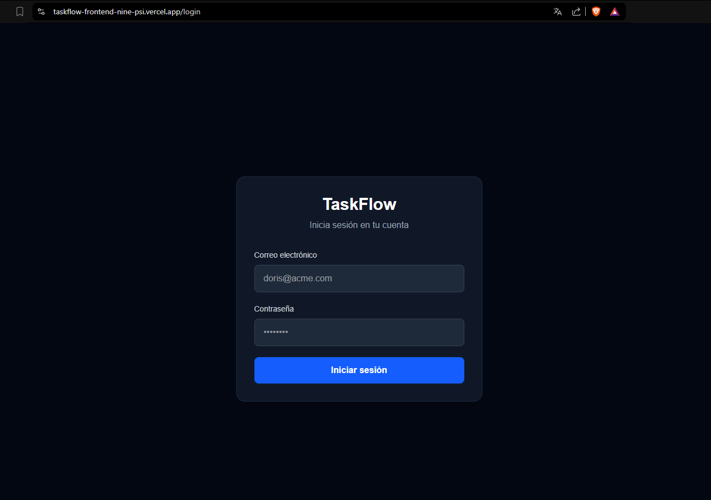
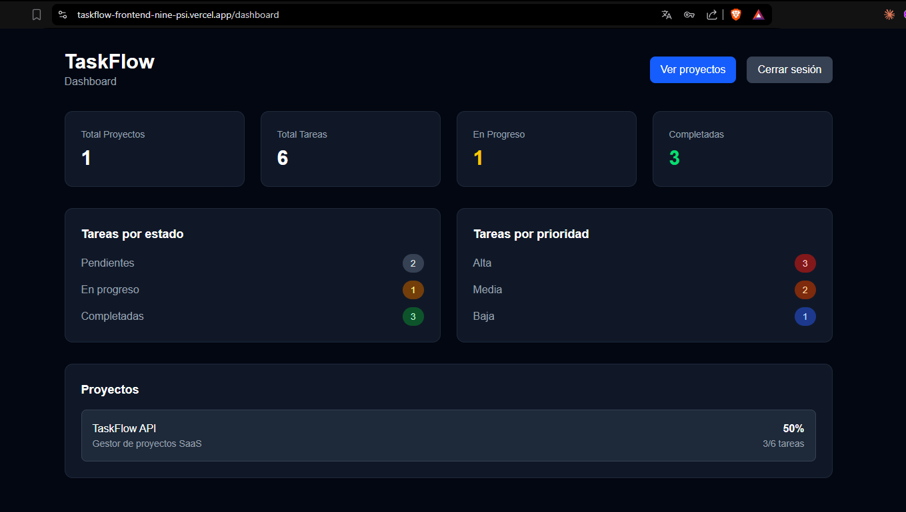
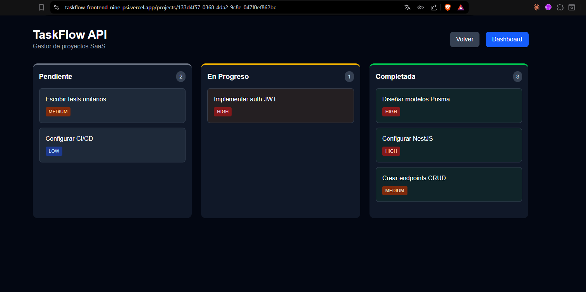
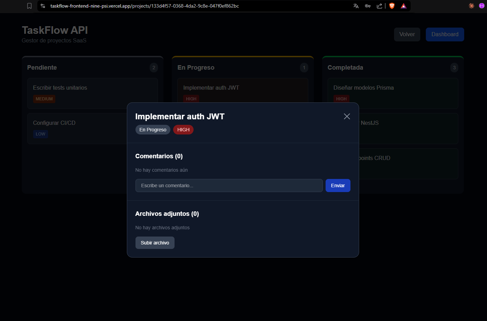

# CLAUDE.md — TaskFlow API

## Descripción del proyecto

TaskFlow es un gestor de proyectos SaaS multi-tenant construido con NestJS.
El proyecto evoluciona en 8 niveles de complejidad, desde un CRUD básico hasta un sistema distribuido en producción.
El objetivo es aprender NestJS progresivamente con un proyecto real digno de portafolio.

## Stack tecnológico

- **Framework:** NestJS (TypeScript, CommonJS)
- **ORM:** Prisma (se integra en Nivel 3)
- **Base de datos:** PostgreSQL (se integra en Nivel 3)
- **Caché/Colas:** Redis + BullMQ (se integra en Nivel 6)
- **Auth:** JWT con access + refresh token (se integra en Nivel 4)
- **Testing:** Jest
- **Docs:** Swagger/OpenAPI (se integra en Nivel 7)
- **Contenedores:** Docker + Docker Compose (se integra en Nivel 7)
- **CI/CD:** GitHub Actions (se integra en Nivel 8)
- **Observabilidad:** OpenTelemetry (se integra en Nivel 8)

## Estructura del proyecto

```
src/
├── common/              # Módulo compartido (servicios, pipes, filtros, utils)
│   ├── dto/
│   │   └── pagination.dto.ts
│   ├── filters/
│   │   └── http-exception.filter.ts
│   ├── interceptors/
│   │   └── response.interceptor.ts
│   ├── middleware/
│   │   └── logging.middleware.ts
│   ├── services/
│   │   ├── id-generator.service.ts
│   │   └── prisma.service.ts
│   └── common.module.ts
├── projects/            # Módulo de proyectos (Clean Architecture)
│   ├── domain/
│   │   ├── entities/
│   │   │   └── project.entity.ts
│   │   ├── repositories/
│   │   │   └── project.repository.ts
│   │   └── use-cases/
│   │       ├── create-project.use-case.ts
│   │       ├── find-all-projects.use-case.ts
│   │       ├── find-one-project.use-case.ts
│   │       ├── update-project.use-case.ts
│   │       └── remove-project.use-case.ts
│   ├── infrastructure/
│   │   └── prisma-project.repository.ts
│   ├── dto/
│   ├── projects.controller.ts
│   ├── projects.module.ts
│   └── projects.service.ts
├── tasks/               # Módulo de tareas
│   ├── dto/
│   ├── tasks.controller.ts
│   ├── tasks.module.ts
│   └── tasks.service.ts
├── auth/                # Módulo de autenticación
│   ├── decorators/
│   │   ├── current-user.decorator.ts
│   │   └── roles.decorator.ts
│   ├── guards/
│   │   ├── auth.guard.ts
│   │   └── roles.guard.ts
│   ├── dto/
│   ├── auth.controller.ts
│   ├── auth.module.ts
│   └── auth.service.ts
├── comments/            # Módulo de comentarios
│   ├── dto/
│   ├── comments.controller.ts
│   ├── comments.module.ts
│   └── comments.service.ts
├── attachments/         # Módulo de archivos adjuntos
│   ├── attachments.controller.ts
│   ├── attachments.module.ts
│   └── attachments.service.ts
├── notifications/       # Módulo de notificaciones (microservicio)
│   ├── notifications.module.ts
│   ├── notifications.processor.ts
│   └── notifications.service.ts
├── events/              # Eventos de dominio
│   ├── events/
│   │   └── task-assigned.event.ts
│   ├── listeners/
│   │   └── task-assigned.listener.ts
│   ├── gateways/
│   │   └── task-events.gateway.ts
│   └── events.module.ts
├── health/              # Health checks
│   ├── health.controller.ts
│   └── health.module.ts
├── tracing.ts           # OpenTelemetry
├── app.module.ts
└── main.ts
```

## Roadmap por niveles

### Nivel 1 ✅ — El esqueleto
- CRUD de proyectos y tareas con arrays en memoria
- DTOs validados con class-validator
- Relación projects → tasks vía projectId
- Endpoints: `/projects`, `/projects/:projectId/tasks`, `/tasks/:id`

### Nivel 2 ✅ — Arquitectura modular
- CommonModule con servicios compartidos (IdGeneratorService)
- Filtro de excepción global (formato estándar de error)
- Pipe de validación de UUID (ParseUUIDPipe)

### Nivel 3 ✅ — Base de datos real
- Prisma 7 + PostgreSQL con adapter pg
- Modelos: Project, Task, User (sin auth)
- Relaciones: proyecto → tareas (1:N), usuario ↔ proyectos (N:M)
- Migraciones, seed, config por ambiente con @nestjs/config
- onDelete: Cascade en relaciones

### Nivel 4 ✅ — Auth y permisos
- Registro, login, JWT (access + refresh token)
- Modelo Organization (multi-tenant)
- Guards: AuthGuard (manual con JwtService), RolesGuard
- Roles: ADMIN, LEADER, MEMBER (registro siempre crea MEMBER)
- Decorador @CurrentUser() con createParamDecorator
- Filtrado por organizationId en queries

### Nivel 5 ✅ — Pulir y testear
- Interceptor de respuesta estándar: { success, data, meta }
- Paginación genérica con PaginationDto
- Soft deletes (deletedAt en Project y Task)
- Logging estructurado (middleware con requestId)
- Tests unitarios: 15/15 green, cobertura >85% en services
- Mocks de PrismaService, CACHE_MANAGER y EventEmitter2

### Nivel 6 ✅ — Features de producto real
- Colas con BullMQ + Redis (notificación al asignar tarea)
- Caché con Redis en GET /projects (invalidación en create/update/remove)
- Upload de archivos adjuntos a tareas (multer + diskStorage)
- Comentarios en tareas (CRUD completo)
- Tests e2e: 11/11 green con supertest

### Nivel 7 ✅ — Escalar la arquitectura
- Microservicio de notificaciones (transport Redis)
- Rate limiting por tenant (@nestjs/throttler, 30 req/min)
- Swagger auto-generado con @ApiTags, @ApiOperation, @ApiResponse, @ApiParam, @ApiProperty
- Health checks (@nestjs/terminus + PrismaHealthIndicator)
- Dockerfile multi-stage + Docker Compose (postgres, redis, api)

### Nivel 8 ✅ — Producción real
- Clean architecture en Projects (domain/entities, repositories, use-cases, infrastructure)
- Eventos de dominio (EventEmitter2, TaskAssignedEvent, listeners desacoplados)
- WebSockets (Socket.io gateway, tiempo real con task.assigned)
- OpenTelemetry (tracing distribuido con Jaeger)
- CI/CD con GitHub Actions (pipeline: tests + build en cada push a main)
- Deploy a cloud (Render)

## Convenciones de código

### Nomenclatura
- **Archivos:** kebab-case (`create-project.dto.ts`)
- **Clases:** PascalCase (`ProjectsService`)
- **Variables/funciones:** camelCase (`findAll`, `projectId`)
- **Enums:** PascalCase con valores UPPER_SNAKE_CASE (`TaskStatus.IN_PROGRESS`)

### DTOs
- Usar `class-validator` con mensajes en español
- `CreateDto`: campos requeridos con validación estricta
- `UpdateDto`: extender con `PartialType(CreateDto)` de `@nestjs/swagger`
- `@ApiProperty()` en todos los campos para documentación Swagger

### Servicios
- Lanzar `NotFoundException` cuando un recurso no existe (usar `throw`, nunca `return`)
- Reutilizar `this.findOne()` internamente en update/remove
- Métodos async con await en operaciones de Prisma

### Controllers
- IDs son UUID (string), nunca convertir con `+id`
- `@Controller()` vacío cuando las rutas van en cada decorador
- `@UseGuards(AuthGuard, RolesGuard)` en controllers protegidos
- `@ApiTags()`, `@ApiBearerAuth()` para Swagger

### Módulos
- Exportar servicios que otros módulos necesiten vía `exports`
- Importar módulos externos vía `imports`
- `PROJECT_REPOSITORY` con `useClass` para Clean Architecture

## Comandos útiles

```bash
npm run start:dev          # Desarrollo con hot reload
npm run build              # Compilar
npm run test               # Tests unitarios
npm run test:e2e           # Tests e2e
npm run test:cov           # Cobertura
```

## Git workflow

- Rama por nivel: `nivel-1`, `nivel-2`, etc.
- Al completar un nivel: merge a `main`
- Formato de commits: `feat: Nivel X - descripción`
- Repositorio: https://github.com/DMosqueraL/taskflow-api

## Nivel actual: 8 ✅ (completado)

## Deploy a Render

### Paso 1 — Crear PostgreSQL
1. Dashboard → New → Postgres
2. Name: `taskflow-db`, Plan: Free
3. Copiar Internal Database URL

### Paso 2 — Crear Redis
1. Dashboard → New → Key Value
2. Name: `taskflow-redis`, Plan: Free
3. Copiar Internal Redis URL (solo el hostname para REDIS_HOST)

### Paso 3 — Crear Web Service
1. Dashboard → New → Web Service
2. Conectar repo: `DMosqueraL/taskflow-api`
3. Language: Docker, Branch: main, Plan: Free

### Paso 4 — Variables de entorno
```bash
DATABASE_URL=<Internal Database URL de PostgreSQL>
REDIS_HOST=<hostname de Redis sin redis:// ni puerto>
REDIS_PORT=6379
JWT_SECRET=<secreto de producción>
JWT_REFRESH_SECRET=<otro secreto de producción>
PORT=3005
```

### Paso 5 — Verificar
- URL pública: `https://taskflow-api-XXXX.onrender.com/health`
- Logs: Dashboard → Logs
- Auto-deploy: cada push a main despliega automáticamente

## Bonus — Frontend (Next.js)

### Stack
- Next.js 14+ (App Router)
- Tailwind CSS
- Socket.io client (WebSockets)
- Deploy en Vercel

### Páginas
1. `/login` — formulario que consume POST /auth/login
2. `/dashboard` — métricas: total proyectos, tareas por estado, tareas atrasadas
3. `/projects` — lista de proyectos con paginación
4. `/projects/:id` — tablero Kanban (columnas: PENDING, IN_PROGRESS, DONE)
5. Drag & drop para cambiar estado de tareas
6. Modal de tarea con comentarios y archivos adjuntos
7. WebSocket para actualización en tiempo real

### URLs de producción
- Frontend: https://taskflow-frontend-nine-psi.vercel.app
- Backend: https://taskflow-api-sg4x.onrender.com
- Swagger: https://taskflow-api-sg4x.onrender.com/api/docs
- Health: https://taskflow-api-sg4x.onrender.com/health

### Estado: completado ✅

### Screenshots






## Estructura con Clean Architecture (objetivo final)

Patrón aplicado en Projects como referencia. Replicar en Tasks, Comments y Attachments.

```
src/
├── common/
│   ├── dto/
│   │   └── pagination.dto.ts
│   ├── filters/
│   │   └── http-exception.filter.ts
│   ├── interceptors/
│   │   └── response.interceptor.ts
│   ├── middleware/
│   │   └── logging.middleware.ts
│   ├── services/
│   │   ├── id-generator.service.ts
│   │   └── prisma.service.ts
│   └── common.module.ts
│
├── projects/
│   ├── domain/
│   │   ├── entities/
│   │   │   └── project.entity.ts
│   │   ├── repositories/
│   │   │   └── project.repository.ts      # Interface (contrato)
│   │   └── use-cases/
│   │       ├── create-project.use-case.ts
│   │       ├── find-all-projects.use-case.ts
│   │       ├── find-one-project.use-case.ts
│   │       ├── update-project.use-case.ts
│   │       └── remove-project.use-case.ts
│   ├── infrastructure/
│   │   └── prisma-project.repository.ts   # Implementación con Prisma
│   ├── dto/
│   │   ├── create-project.dto.ts
│   │   └── update-project.dto.ts
│   ├── projects.controller.ts
│   ├── projects.module.ts
│   └── projects.service.ts               # Orquesta use cases + caché
│
├── tasks/
│   ├── domain/
│   │   ├── entities/
│   │   │   └── task.entity.ts
│   │   ├── repositories/
│   │   │   └── task.repository.ts
│   │   └── use-cases/
│   │       ├── create-task.use-case.ts
│   │       ├── find-all-tasks.use-case.ts
│   │       ├── find-one-task.use-case.ts
│   │       ├── update-task.use-case.ts
│   │       ├── assign-task.use-case.ts
│   │       └── remove-task.use-case.ts
│   ├── infrastructure/
│   │   └── prisma-task.repository.ts
│   ├── dto/
│   ├── tasks.controller.ts
│   ├── tasks.module.ts
│   └── tasks.service.ts
│
├── comments/
│   ├── domain/
│   │   ├── entities/
│   │   │   └── comment.entity.ts
│   │   ├── repositories/
│   │   │   └── comment.repository.ts
│   │   └── use-cases/
│   │       ├── create-comment.use-case.ts
│   │       ├── find-all-comments.use-case.ts
│   │       ├── find-one-comment.use-case.ts
│   │       ├── update-comment.use-case.ts
│   │       └── remove-comment.use-case.ts
│   ├── infrastructure/
│   │   └── prisma-comment.repository.ts
│   ├── dto/
│   ├── comments.controller.ts
│   ├── comments.module.ts
│   └── comments.service.ts
│
├── attachments/
│   ├── domain/
│   │   ├── entities/
│   │   │   └── attachment.entity.ts
│   │   ├── repositories/
│   │   │   └── attachment.repository.ts
│   │   └── use-cases/
│   │       ├── upload-attachment.use-case.ts
│   │       ├── find-all-attachments.use-case.ts
│   │       └── remove-attachment.use-case.ts
│   ├── infrastructure/
│   │   └── prisma-attachment.repository.ts
│   ├── attachments.controller.ts
│   ├── attachments.module.ts
│   └── attachments.service.ts
│
├── auth/
│   ├── decorators/
│   │   ├── current-user.decorator.ts
│   │   └── roles.decorator.ts
│   ├── guards/
│   │   ├── auth.guard.ts
│   │   └── roles.guard.ts
│   ├── dto/
│   ├── auth.controller.ts
│   ├── auth.module.ts
│   └── auth.service.ts
│
├── notifications/
│   ├── notifications.module.ts
│   ├── notifications.processor.ts
│   └── notifications.service.ts
│
├── events/
│   ├── events/
│   │   └── task-assigned.event.ts
│   ├── listeners/
│   │   └── task-assigned.listener.ts
│   ├── gateways/
│   │   └── task-events.gateway.ts
│   └── events.module.ts
│
├── health/
│   ├── health.controller.ts
│   └── health.module.ts
│
├── tracing.ts
├── app.module.ts
└── main.ts
```

### Patrón por módulo

Cada módulo refactorizado sigue esta estructura:

| Capa | Archivo | Responsabilidad |
|------|---------|-----------------|
| **Dominio** | `entity.ts` | Entidad con reglas de negocio (puro TS) |
| **Dominio** | `repository.ts` | Interface — contrato de operaciones |
| **Dominio** | `use-case.ts` | Lógica de negocio (un caso de uso por archivo) |
| **Infra** | `prisma-*.repository.ts` | Implementación con Prisma |
| **App** | `service.ts` | Orquestador — delega a use cases, maneja caché |
| **App** | `controller.ts` | Traduce HTTP a llamadas al service |
| **App** | `module.ts` | Inyección: `{ provide: TOKEN, useClass: PrismaRepo }` |

### Cambiar de ORM

Solo modificar `useClass` en el module:
```typescript
// Prisma → TypeORM
{ provide: TASK_REPOSITORY, useClass: TypeOrmTaskRepository }
// Prisma → Mongoose
{ provide: TASK_REPOSITORY, useClass: MongoTaskRepository }
```
El dominio, los use cases, los controllers y los services NO se tocan.

## Notas importantes
- `moduleFormat = "commonjs"` para compatibilidad NestJS
- Cada nivel se construye sobre el anterior — no se descarta código, se evoluciona
- El proyecto es de aprendizaje: priorizar comprensión sobre velocidad
- Clean Architecture: para cambiar de ORM, solo modificar `useClass` en el module del módulo refactorizado (ej: `useClass: TypeOrmProjectRepository` en projects.module.ts). El dominio y los controllers no se tocan.
